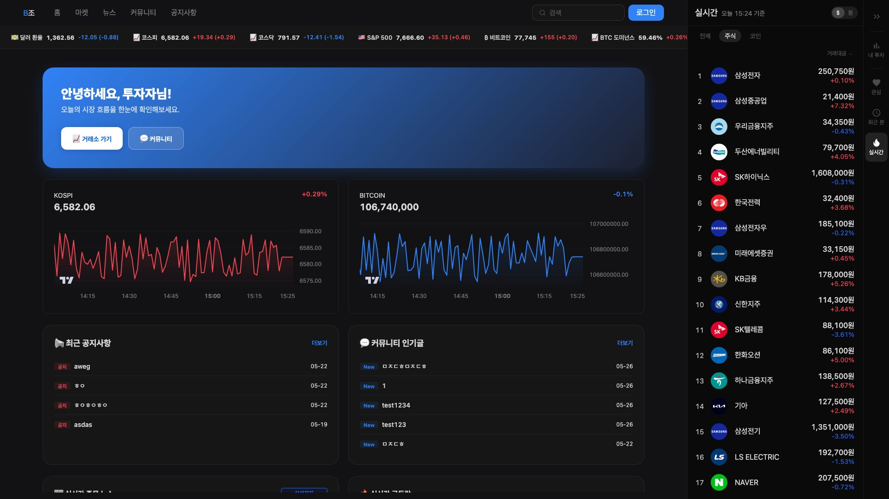
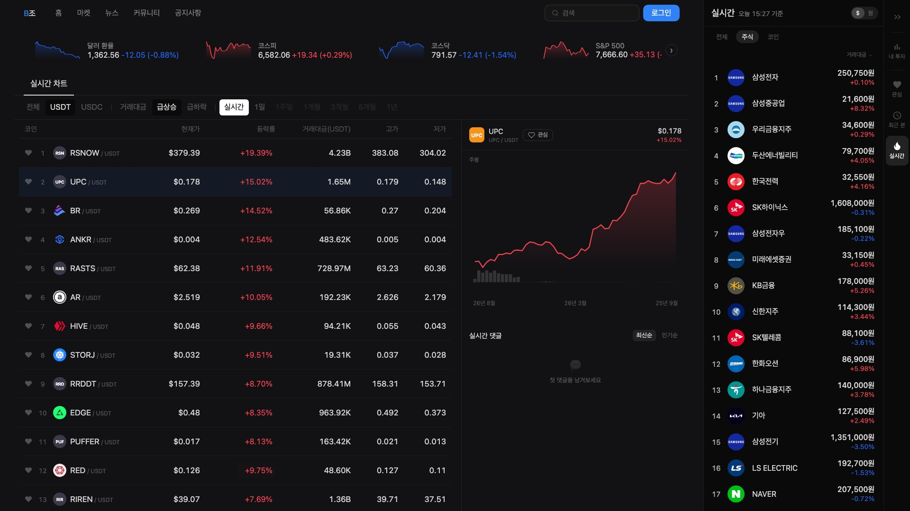
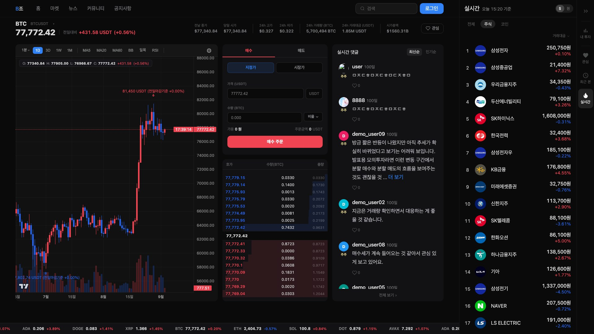
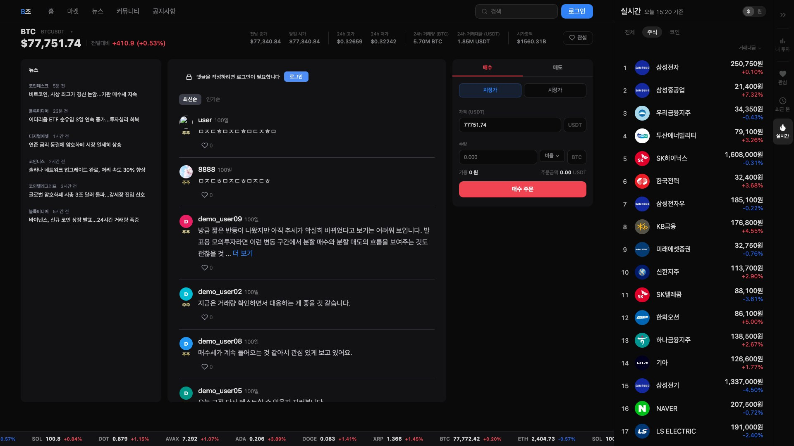
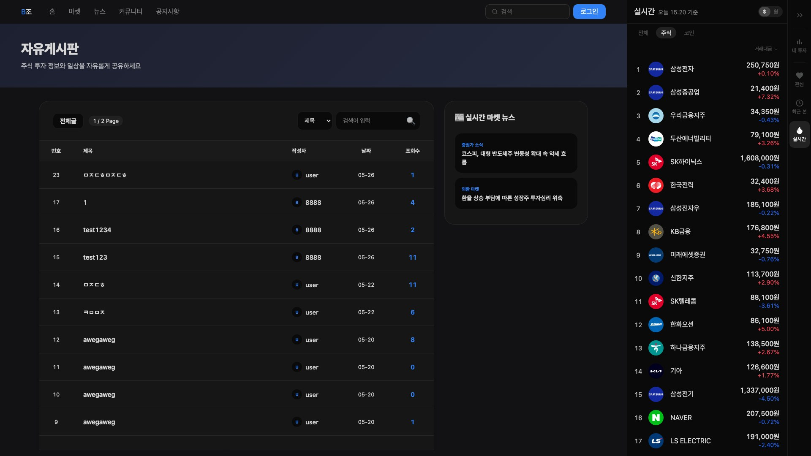

# Koss - 주식·코인 통합 모의투자 플랫폼

KOSMO 개발 과정 2인 팀 프로젝트. 토스증권 UI를 참고하여 주식·코인 시세 조회, 모의 주문, 종목별 커뮤니티, 게시판을 한 화면 흐름으로 통합.

- 원본 팀 저장소: [hat8532/tpm](https://github.com/hat8532/tpm) (`tpm`은 저장소명, 서비스명은 Koss)
- 본 저장소: 팀 저장소 fork. `main`은 팀 저장소 `sub_main` 최종 상태와 동일
- 개발 기간: 2026.05.11 ~ 2026.05.24

## 화면

<p align="center">
  <a href="docs/images/readme/01-home.jpg"></a>
  <a href="docs/images/readme/02-coin-list.jpg"></a>
  <a href="docs/images/readme/03-coin-chart.jpg"></a>
  <a href="docs/images/readme/04-community.jpg"></a>
  <a href="docs/images/readme/05-board.jpg"></a>
</p>

홈 · 코인 목록 · 코인 차트·주문 · 종목 커뮤니티 · 자유게시판 (클릭 시 원본 1920×1080)

## 주요 기능

- **주식**: 종목 검색·목록, 일봉·미니 차트, 한국투자증권 WebSocket 실시간 체결가, 모의 매수·매도 및 예약 주문
- **코인**: 거래소 API 시세·목록, 상세 차트, 모의 주문, 지갑·보유 자산 관리
- **시장 지수·환율**: 국내외 지수, 환율 조회
- **종목별 커뮤니티**: 주식·코인 종목 페이지별 댓글 작성·수정·삭제·좋아요
- **게시판·공지·뉴스**: 게시글 CRUD, 댓글, 좋아요, 파일 첨부, 공지사항, 뉴스 목록
- **회원·자산**: 회원가입·로그인·프로필, 보유 자산 요약

## 기술 스택

| 구분 | 내용 |
| --- | --- |
| Language | Java 21 |
| Framework | Spring Boot 3.5, Spring MVC, Spring AOP, Spring Validation |
| View | JSP, JSTL |
| Data | MyBatis, PostgreSQL |
| Realtime / HTTP | Spring WebSocket, Spring WebFlux (WebClient) |
| Build | Gradle (war) |
| Frontend | Vanilla JS, CSS |

외부 API: 한국투자증권 Open API(WebSocket), 네이버 금융, Yahoo Finance, Bitget, CoinGecko, CoinLore, Frankfurter(환율), 네이버 오픈 API(뉴스)

## 프로젝트 구조

```
src/main/java/com/tj/app
├── member/            회원, 프로필, 권한
├── board/             게시판, 좋아요, 댓글
├── notice/            공지사항
├── news/              뉴스
├── asset/             자산 요약
├── market/
│   ├── stock/         주식 시세, 차트, WebSocket, 주문(order)
│   ├── coin/          코인 시세, 차트, 주문(order)
│   ├── index/         시장 지수
│   ├── exchange/      환율
│   └── community/     종목별 커뮤니티 댓글·좋아요
└── common/            파일 업로드, 페이징, WebSocket·리소스 설정

src/main/webapp/WEB-INF/views   JSP 화면 (common/: nav, sidebar, 주문 패널)
src/main/resources/static       JS, CSS
```

## 팀 구성 및 담당

| 담당 | 내용 |
| --- | --- |
| Hdev-x (본인) | 코인 시세·차트·주문, 종목별 커뮤니티, 공통 UI(사이드바·상단 내비게이션·화면 레이아웃), 게시판·공지 UI |
| hat8532 | 주식 시세·주문·WebSocket, 회원, 프로젝트 기반 설정 |

## 실행 방법

1. PostgreSQL 데이터베이스 준비
2. `src/main/resources/application-dev.properties` 생성 후 DB 접속 정보·외부 API 키 입력 (Git 미포함)
3. 실행

```bash
./gradlew bootRun
```

- 기본 포트 80. `application.properties`의 `server.port`로 변경
- 실시간 주식 시세 미사용 시 `app.stock.websocket.enabled=false`

## 이후 진행: Bubot

- 본 프로젝트 기반 개인 프로젝트 [Bubot](https://github.com/Hdev-x/Bubot) 개발
- 프론트엔드 JSP → React·TypeScript·Vite 전환, 코인 시세·차트 조회 중심으로 발전
